# Architecture

This page describes the internal architecture and build pipeline of Sapling.

## High-Level Overview

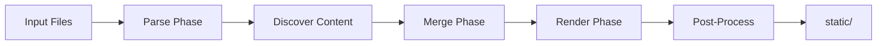

## Phase 1: Parse Templates

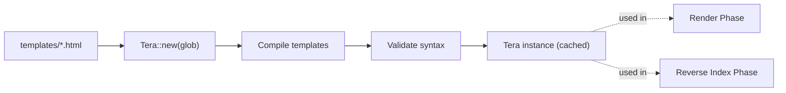

Templates are loaded once via glob pattern and compiled into a Tera instance. This instance is reused for all rendering operations.

## Phase 2: Discover Content

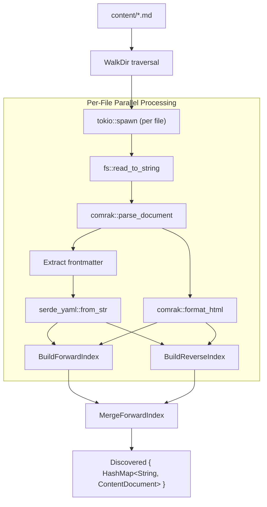

Each markdown file is parsed in parallel. Indexes are built during discovery.

### Per-File Flow Detail

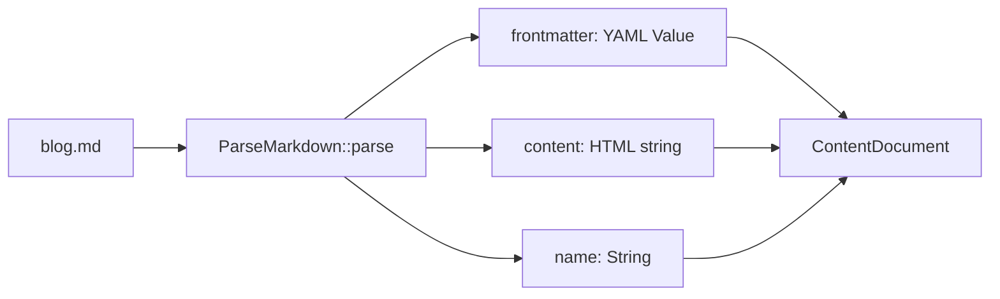

## Phase 3: Merge ForwardIndex

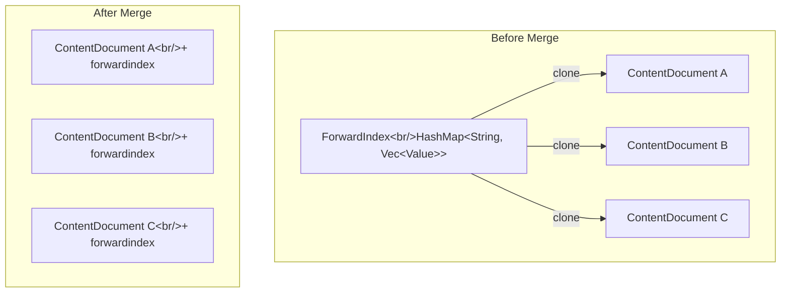

**Bottleneck:** Each ContentDocument gets a full clone of the forwardindex. For N documents, this is O(n²) memory.

## Phase 4: Render HTML

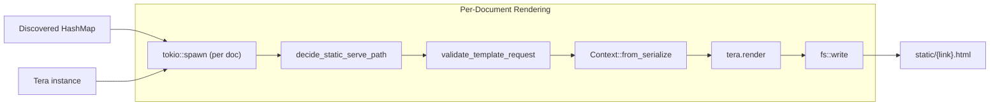

Each document is rendered in parallel using the cached Tera instance.

## Phase 5: CSS Bundle

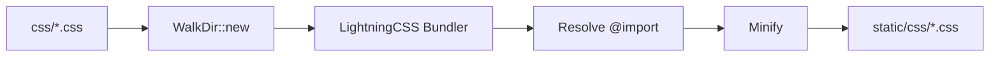

CSS files are bundled and minified using LightningCSS. This phase is sequential.

## Phase 6: Copy Assets

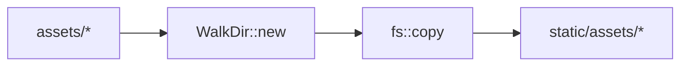

Direct file copy, no transformation.

## Phase 7: Reverse Index Render

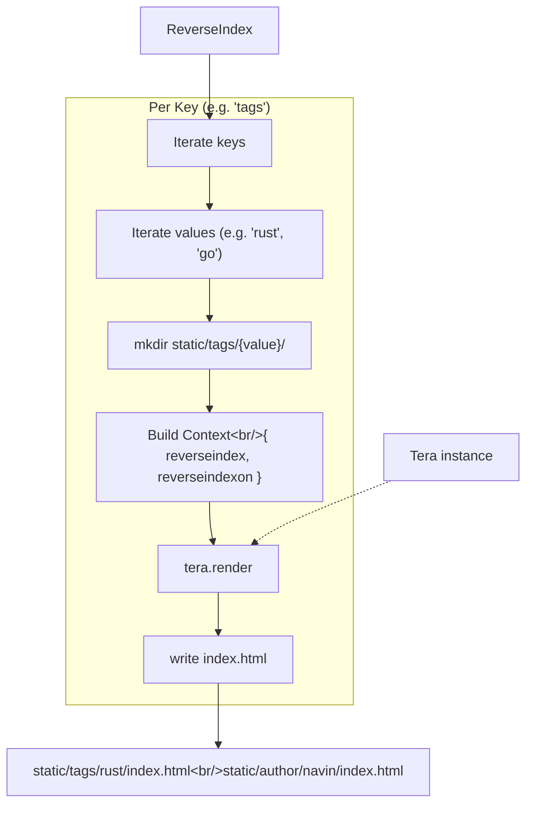

Generates listing pages for each tag, author, or other reverse-indexed field.

## Phase 8: RSS Generation

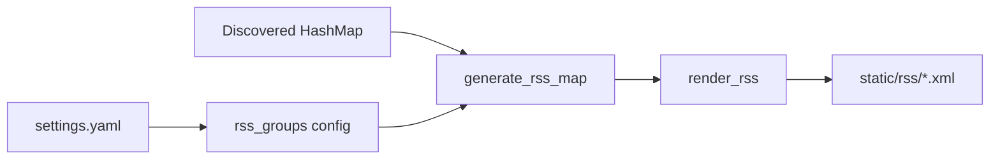

## Pipeline Stages Summary

| Stage | Module | Parallel? | Description |
|-------|--------|-----------|-------------|
| Parse Templates | `ParseTemplate` | No | Load all templates via Tera glob, compile once |
| Discover Content | `LoadMemory` | Yes (per file) | Walk content/, parse MD in parallel, build indices |
| Merge ForwardIndex | `LoadMemory` | No | Clone forwardindex into every ContentDocument |
| Render HTML | `RenderMarkdown` | Yes (per doc) | Apply templates, write HTML files |
| Bundle CSS | `RenderMarkdown` | No | LightningCSS bundle + minify each CSS file |
| Copy Assets | `RenderMarkdown` | No | Direct file copy |
| Reverse Index | `ReverseIndex` | No | Generate tag/author listing pages |
| RSS | `rss` | No | Generate RSS XML feeds |

## Data Structures

### ContentDocument

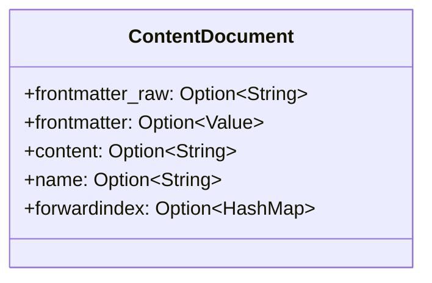

### Index Structures

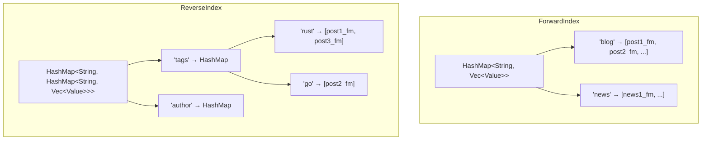

### Core Types

| Type | Location | Description |
|------|----------|-------------|
| `ContentDocument` | `ParseMarkdown.rs` | Primary data carrier: frontmatter, content HTML, name |
| `Discovered` | `LoadMemory.rs` | Wrapper `HashMap<String, ContentDocument>` |
| `TemplatesMetaData` | `ParseTemplate.rs` | Thin wrapper around Tera instance |
| `ForwardIndex` | `LoadMemory.rs` | `HashMap<String, Vec<Value>>` - keyed by index name |
| `ReverseIndex` | `LoadMemory.rs` | Nested HashMap for tag/author pages |

## Known Bottlenecks

| Issue | Location | Impact | Fix |
|-------|----------|--------|-----|
| O(n²) Memory | `LoadMemory.rs:188-200` | Clones forwardindex into every document | Use `Arc<HashMap>` or Tera global context |
| Sync MD Parsing | `ParseMarkdown::parse` | Blocks tokio worker threads | Use `tokio::fs` or `rayon` |
| Parent Mutex | `LoadMemory.rs:72-79` | Serializes index updates | Remove or use proper RwLock strategy |
| Sequential CSS | `copy_css_files` | No parallelism | Parallelize bundling |