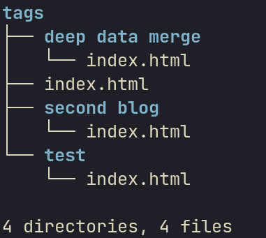

# Reverse Index

Reverse indices are slight bit harder to grasp, so stick with me here! Say you have two blogs with the following front matter : 

`content/blog1.md`:
```
---
template : "blog.html"
title : "First blog testing Markdown elements"
date : "01-20-2002"
link : "/blogs/blog1"
author : ["P K Navin Shrinivas"]
tags : ["test","deep data merge"]
forwardindex : blog
reverseindex : ["author","tags"]
```

`content/blog2.md`:
```
---
template : "blog.html"
title : "Second blog to test indexs"
date : "01-20-2002"
link : "/blogs/blog2"
author : ["Anirudh Rowjee"]
tags : ["test","second blog"]
forwardindex : blog
reverseindex : ["author","tags"]
---
```

> Note : unlike 11ty, reverse inices (that are similar to collections) can be done on any number of tags as you wish.

Now in the above example, you will have the following : 
- A list of frontmatter with the tag `test`.
- A list of frontmatter with the tag `deep data merge`.
- A list of frontmatter with the tag `second blog`.
- A list of fronmatter of posts with author `P K Navin Shrinivas`.
- A list of fronmatter of posts with author `Anirudh Rowjee`.

## What sapling does with the reverse indices. **IMPORTANT PART**

It by default tries to generate a page for each of the value it found in those tags. It seraches for the template for this page in `/templates/reverseindex`. 
**IT WILL GIVE AN ERROR IF IT DOESNT FIND A TEMPLATE FOR EACH TAG IT INDEXED ON**.

In the above case, we need two templates, namely : `templates/reverseindex/tags.html` and `templates/reverseindex/author.html`

> Note : you can feel free to leave it empty, I does't render anything in that case.

The `templates/reverseindex/tags.html` will look something like this : 
```html
      <header>
         
            <h1>Posts with the tag : {{reverseindexon}}</h1>
         
      </header>
      
      <div class="postlist">
         
         <aside>
            <a href={{ i.link }}>
               <h3>{{ i.title }}</h3>
               <p><b>Date : </b>{{ i.date }}</p>
            </a>
            <div class="tagslist">
               tags : 
               
               <a href="/tags/{{k}}"><code>{{k}}</code></a>
               
            </div>
            
         </aside>
      </div>
      
```
The important variables to focus on is `reverindexon` which contains the value in the tag this reverseindex list will contain. `reverseindex` is the list itself.
`sapling` will feed this template one by one with all the values it find in the `tags` attribute wherever we have asked for a reverse index!

In the end of this process you'll have a structure like this in the static folder : 


